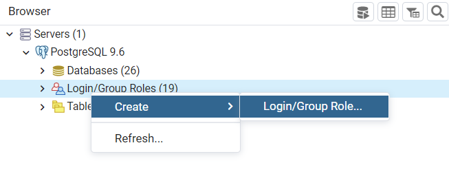
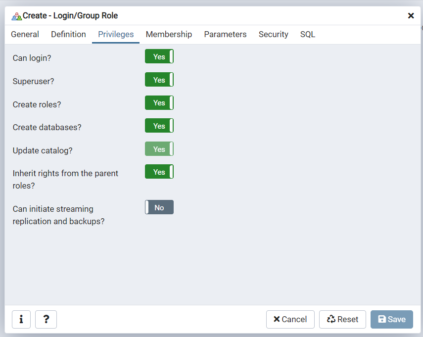
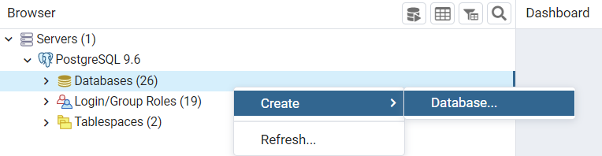
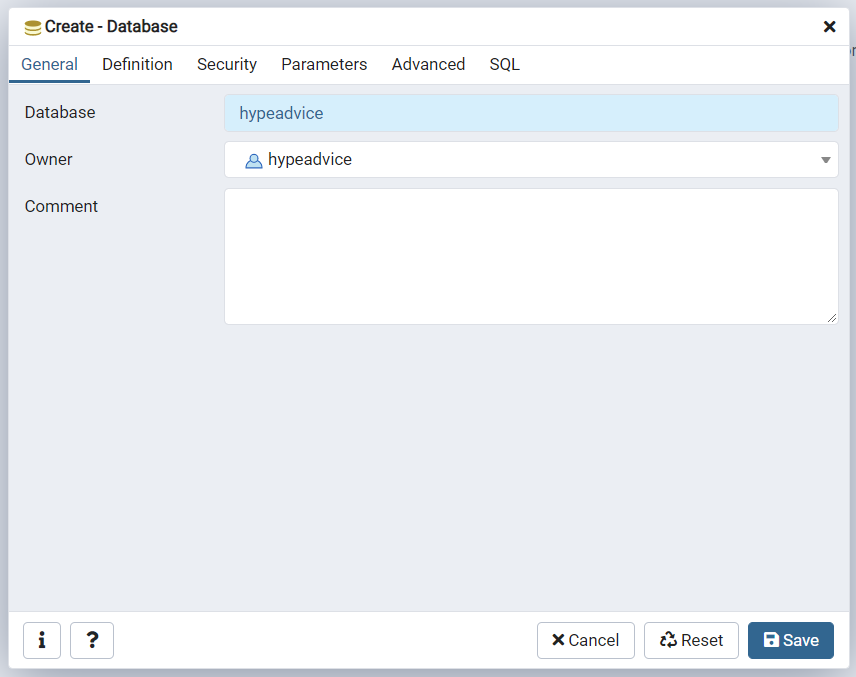

# Projeto Hype Advice

* Exercicio 1 - Configuração

Alterado o Dialect do Banco para o Postgres 13.

* Exercicio 2 - Tipo de Conselho

Foi implementado um Enum com os tipos GRATUITO e PAGO. 
Esse Enum foi adicionado na entidade Advice, não pode ser nulo e mostrado na tabela do cadastro conforme solicitado.
Adicionado o PostMapping para salvar um novo Conselho.

* Exercicio 3 - Consumo de API Rest

Adicionado a busca do conselho por ID com as devidas validações.
Feito a mensagem customizada em caso de ID não encontrado e mensagem de sucesso caso a busca retorne valor.
Obs: no retorno por ID a API externa não retorna o date, foi adicionado a data atual, porém poderia ser uma outra solução, como criar um SlipVO separado.

* Exercicio 4 - Modelagem de Banco de Dados

Arquivo adicionado na pasta /exemplos-modelagem/script.txt

Arquivo para criação das tabelas de Cliente, Conselho e Venda.
Ter um pré cadastro de cliente ou recuperar de Login, etc.
Minha sugestão é vincular na criação do Conselho o Cliente (caso seja via login não seria necessário).
Na tabela de Venda ter o vinculo do Conselho com Cliente e a data da compra, poderia ter também outros campos como valor, etc.
Essas transações também poderiam conter dados de auditoria como UUID, data_hora, usuário, etc.

* Classes criadas/alteradas

AdviceBean
AdviceListBean
AdviceV1
Advice
AdviceTypeEnum
RecursoNaoEncontradoException
AdviceService
AdvicesLIPService
advice-crud
advice-list
application.properties
script.txt

-----------------------------------------------------------------------------------------------------------------------------------------

Siga as orientações abaixo para configurar o projeto:

* Faça o download e instalação do postgres versão **9.6.24** no link https://www.enterprisedb.com/downloads/postgres-postgresql-downloads
* Faça o download e instalação do pgAdmin no link https://www.pgadmin.org/download/
* Após instalado e configurado crie um super user com nome **hypeadvice** e senha **hypeadvice** no pgAdmin

* Crie um data base com nome **hypeadvice** e defina o owner **hypeadvice**

**IMPORTANTE:** garanta que o data base fique em "jdbc:postgresql://localhost:5432/hypeadvice", caso contrario atualize o parametro spring.datasource.url do arquivo application.properties

* O projeto deve rodar na JDK versão **8**
* Baixe as dependências via **Maven**

* Indicamos que seja utilizado como IDE o Intellij link: https://www.jetbrains.com/idea/download/

Após iniciar a aplicação, acesse http://localhost:8080/advice-list.xhtml
